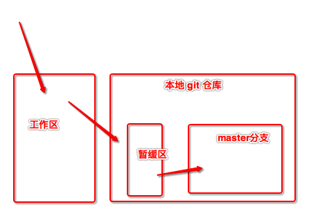

# 一. git 常用命令回顾


 


- `git init` : 初始化 git 本地仓库
- `git add . `: 将工作去编写的代码提交奥暂缓区
- `git commit -m '提交信息'` : 将暂缓区的代码提交到本地指定的分支(master分支)
- `git status` : 查看当前工作区和暂缓区中代码提交的状态
  - 显示红色字体描述的内容是在工作区, 尚未提交到本地暂缓区中的内容
  - 显示绿色字体描述的内容是已经从工作去提交到暂缓区, 但是尚未提交到本地分支(master分支)中的内容
  - 如果没有红色和绿色表示全部的代码已经提交到了本地分支(master分支)
- `git remote` : 查看当前git本地仓库关联的远程仓库地址
  - 如果有内容就是说明当前本地仓库有关联远程仓库
  - 如果没有内容, 说明没有关联任何远程仓库地址

> 如果 不知道某个git 命令的用法, 就在命令后面添加 `--help` 查看对应的命令帮助
>
> eg:
>
> git remote --help , 查看 git remote 命令的帮助信息
>
> git add --help , 查看 git add 命令的帮助信息

- `git remote add origin https://github.com/TangChangTomYang/git-usage-note.git`
  - 上面这个命令, 表示给本地git仓库添加一个远程的仓库地址
  - 其中 `origin` 是给远程仓库地址取的名字
  - 其中`https://github.com/TangChangTomYang/git-usage-note.git` 表示的是远程仓库的具体地址
- `git push origin master`
  - 上面这条命令的意思是将git 仓库中已经 `commit` 的内容提交到名为 `origin` 这个远程地址对应的远程仓库的 `master` 分支中
  - `origin` 是远程仓库的地址名字
  - `master` 是远程仓库待提交的分支名
- `git tag`: 查看当前本地仓库的标签情况
- `git tag -a '0.0.1' -m '标签描述信息'` 
  - 上面的命令是给当前的本地仓库打一个标签, `-a 0.0.1` 是指定当前打的标签的版本信息, `-m '标签描述信息'` 是对当前打的标签的一个简短描述
- `git tag '0.0.3'` : 这个本地打标签的一种简写方式, 与`git tag -a '0.0.1' -m '标签描述信息'` 相比 没有了版本的描述信息.
- `git push --tags` : 将当前所有的本地标签, 提交到远程仓库
- `git push origin 0.0.2` : 提交具体的某个标签到git 远程仓库
  - `git push --tags` 与 `git push origin 0.0.2` 的主要区别就是, 前面是提交所有的已经打的标签, 后面的命令只提交具体版本的标签
- `git tag -d '0.0.1'` : 删除本地仓库指定的标签
  - 如果只是删除了本地的标签, 远程没有删除, 可以使用 `git pull` 把本地删除的表现拉下来, 就又有了
- `git push origin :'0.0.1'` : 删除远程指定版本的标签
  - 通过 `git push origin :0.0.1` 删除了远程的标签, 可以再使用`git push --tags` 在将本地的标签添加到远程的仓库里面
- `git log` : 查看git 提交的log 版本信息


# 二. git 添加公私钥


- 在mac 电脑中, 用户目录下有个 `.ssh` 隐藏目录是专门用来存储 公私钥等信息的

- 在mac上生成rsa 公私钥命令

  ```
  ssh-keygen   // 一顿回车出现一个图像就ok了
  ```

  > 当使用命令 `ssh-keygen` 在mac 上创建完成 rsa 的公私钥后会在
  >
  > 用户目录下的 `.ssh` 隐藏目录下自动生成2个文件: `id_rsa` 和 `id_rsa.pub`
  >
  > 其中`id_rsa` 文件中存储的是rsa密钥对的私钥
  >
  > `id_rsa.pub` 是rsa密钥对的公钥, 在使用到rsa非对称加密的时候, 通常只需要把公钥给外面就可以了(使用xcode 打开, 拷贝内容给外部即可), 私钥自己保管

- 我们在git上使用 rsa 免密登录时, 只要操作步骤如下:

  - 1. 使用命令`ssh-keygen` 生成rsa公私钥对
    2. 在用户目录下的`.ssh` 目录下找到公钥`id_rsa.pub` 文件, 将其内容原封不动拷贝粘贴到git中一个存储公钥的内容, 添加保存,基本任务就完成了. 
  - 


