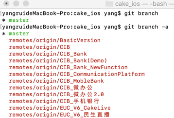

# 一、git切换到指定远程分支


我们在使用git进行开发的时候经常会遇到需要切换远程分支并且提交到远程指定分支的情况，现在记录下操作步骤。


- **查看远程所有分支** 

```
git branch -a
```

`git branch`不带参数,列出本地已经存在的分支，并且在当前分支的前面用`*`标记，加上`-a`参数可以查看所有分支列表，包括本地和远程，远程分支一般会用红色字体标记出来

 


- **新建分支并切换到指定分支** 

```
git checkout -b dev origin/release/caigou_v1.0
```

> git checkout -b 本地分支名 origin/远程分支名
>
> 本地仓库在切换到远程分支时, 可能会报错, 直接按照终端提示操作你可

该命令可以将远程`git`仓库里的指定分支拉取到本地，这样就在本地新建了一个`dev`分支，并和指定的远程分支`release/caigou_v1.0`关联了起来。

```
Switched to a new branch 'dev'
Branch 'dev' set up to track remote branch 'release/caigou_v1.0' from 'origin'.
```


- **查看本地分支及追踪的分支**

```
git branch -vv
```

`git branch -vv`命令可以显示本地所有分支，执行结果如下：

```
* dev    e67e3ef [origin/release/caigou_v1.0] 供应商详情页面
 master 11160c2 [origin/master: behind 5] Merge branch 'master' of https://git.jointforce.com/scm/join/yj-stat 
```

`*`表示当前所在分支，[远程分支]表示当前本地分支追踪的远程分支，最后一个是最近一次提交的注释。


- **将本地分支推送到远程**

```
git push -u origin dev:release/caigou_v1.0
```

> git push <远程主机名> <本地分支名>:<远程分支名>

成功后显示如下：

```
Counting objects: 8, done.
Delta compression using up to 4 threads.
Compressing objects: 100% (8/8), done.
Writing objects: 100% (8/8), 754 bytes | 754.00 KiB/s, done.
Total 8 (delta 6), reused 0 (delta 0)
remote:
remote: Create pull request for release/caigou_v1.0:
remote:   https://git.jointforce.com/projects/JOIN/repos/yj-stat/compare/commits?sourceBranch=refs/heads/release/caigou_v1.0
remote:
To https://git.jointforce.com/scm/join/yj-stat.git
   a22ed65..e8782b2  dev -> release/caigou_v1.0
Branch 'dev' set up to track remote branch 'release/caigou_v1.0' from 'origin'. 
```

上述命令表示将本地`dev`分支推送到远程`release/caigou_v1.0`分支。


